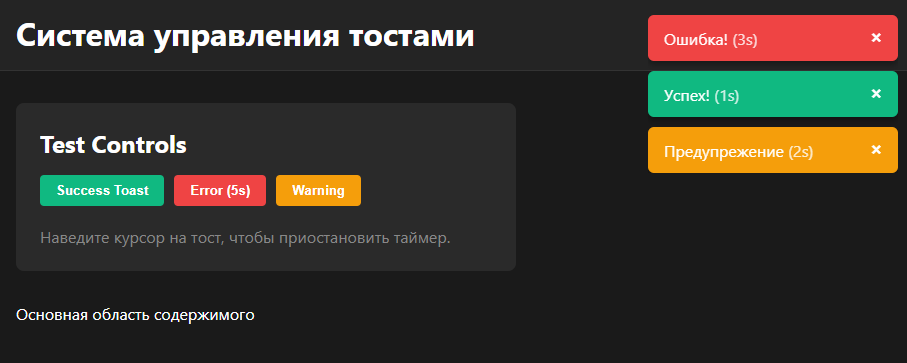

# Система Toast-уведомлений

Система Toast-уведомлений на **React + TypeScript** без сторонних библиотек для нотификаций.  
Реализованы smart-таймер (pause/resume), дедупликация (anti-spam), анимации mount/unmount и тесты бизнес-логики на **Vitest + React Testing Library**.



---

## Реализовано

- **ToastProvider + useToast** — уведомления можно вызывать из любой части приложения.
- **Smart Timer**
  - тост исчезает через `duration`
  - при наведении курсора таймер **ставится на паузу**
  - при уходе курсора таймер **продолжает с остатка**, не сбрасываясь
- **Анти-спам / Дедупликация**
  - если вызывается тост с тем же `message + type`, новый тост **не создаётся**
  - вместо этого **продлевается** существующий (обновляется время жизни)
- **Живой таймер на тосте** - отображение оставшегося времени (в секундах).
- **Анимация появления/исчезновения (mount/unmount)** - плавный выезд справа + exit-анимация перед удалением из DOM.
- **Тесты бизнес-логики (Vitest)**
  - pause/resume по hover
  - дедупликация
  - проверка exit-анимации перед удалением

---

## Стек

- React + TypeScript  
- Vite  
- Vitest  
- React Testing Library  

---

##  Быстрый старт

```bash
npm install
npm run dev
```

Сборка и локальный просмотр:

```bash
npm run build
npm run preview
```

---

## 🧪 Тесты

Запуск тестов (watch-режим):

```bash
npm run test
```

Однократный прогон:

```bash
npx vitest --run
```

### Покрытые сценарии (бизнес-логика)

- **Пауза таймера при наведении**  
  При `mouseEnter` тост не исчезает, пока курсор на нём. При `mouseLeave` продолжает отсчёт с остатка.
- **Дедупликация**  
  Повторный вызов того же `message + type` не создаёт новый тост - продлевает существующий.
- **Unmount-анимация**  
  После истечения `duration` тост сначала получает состояние ухода (exit), и только затем удаляется из DOM.
